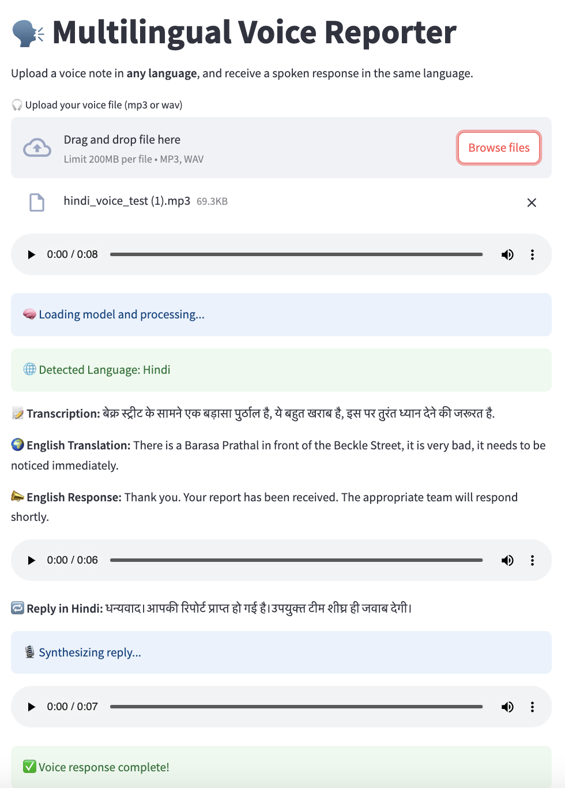

# 🗣️ Multilingual Voice Civic Reporter

A proof-of-concept Streamlit app for cross-lingual civic participation using Whisper, Google Translate, and gTTS.  
This project allows users to upload a voice note in any supported language, and receive a voice response back — in the same language.

---

## 🚀 Features

- 🎧 **Voice Input in Any Language** (e.g., Hindi, French, Yoruba, Arabic, etc.)
- 🧠 **Automatic Language Detection** using Whisper
- 🌍 **English Translation** for civic system use
- 🔁 **Response Generation**: Simulated English system reply
- 🌐 **Translated Back to User's Language**
- 🔊 **Voice Response in Original Language** using gTTS

---

## 📸 Screenshots


## 🎯 Use Case

This app simulates a multilingual civic feedback system.  
A non-English-speaking resident (e.g., Hindi speaker) records a complaint like:

> "सड़क की लाइट बंद है। यहाँ अंधेरा है।"

The system transcribes it, understands the issue, and responds with:

> "आपकी रिपोर्ट मिल गई है। मरम्मत टीम को सूचित किया गया है।" *(spoken back in Hindi)*

---

## 🧱 Tech Stack

- [Streamlit](https://streamlit.io) – frontend and interaction
- [OpenAI Whisper](https://github.com/openai/whisper) – automatic speech recognition (ASR)
- [Google Translate API (via `googletrans`)](https://py-googletrans.readthedocs.io/en/latest/)
- [gTTS (Google Text-to-Speech)](https://pypi.org/project/gTTS/) – speech synthesis

---

## 🛠️ How to Run Locally

```bash
# Clone the repo
git clone https://github.com/your-username/multilingual-voice-reporter.git
cd multilingual-voice-reporter

# Create a virtual environment
python -m venv .venv
source .venv/bin/activate  # on Windows: .venv\\Scripts\\activate

# Install dependencies
pip install -r requirements.txt

# Run the app
streamlit run multilingual.py
